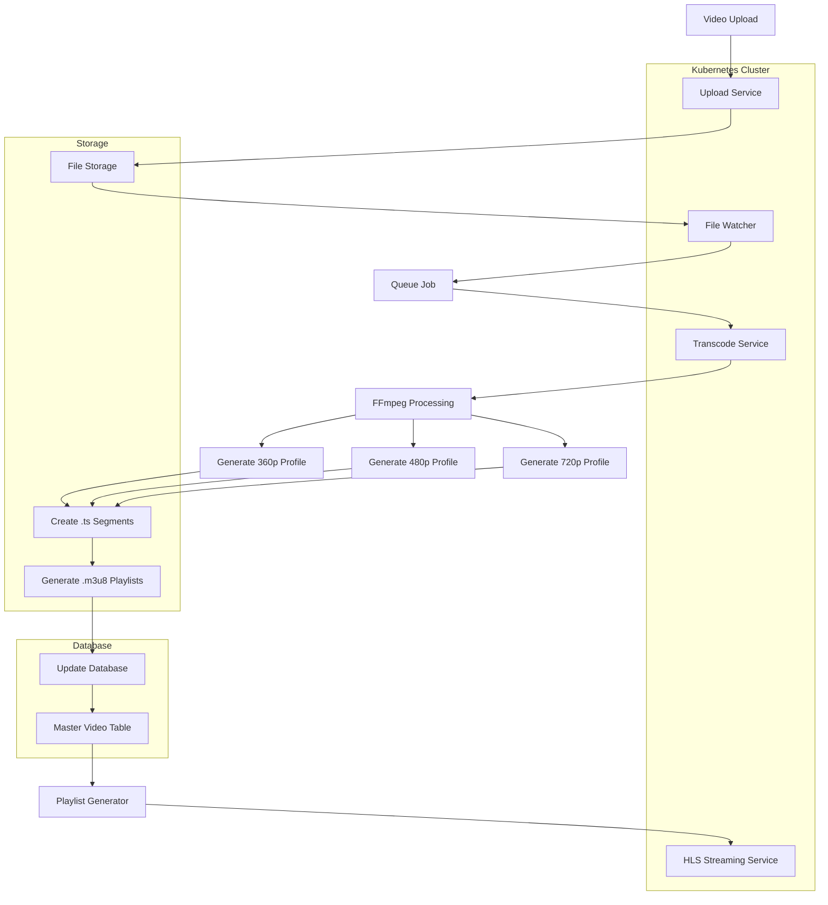
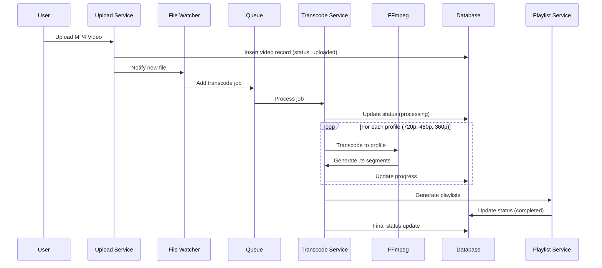
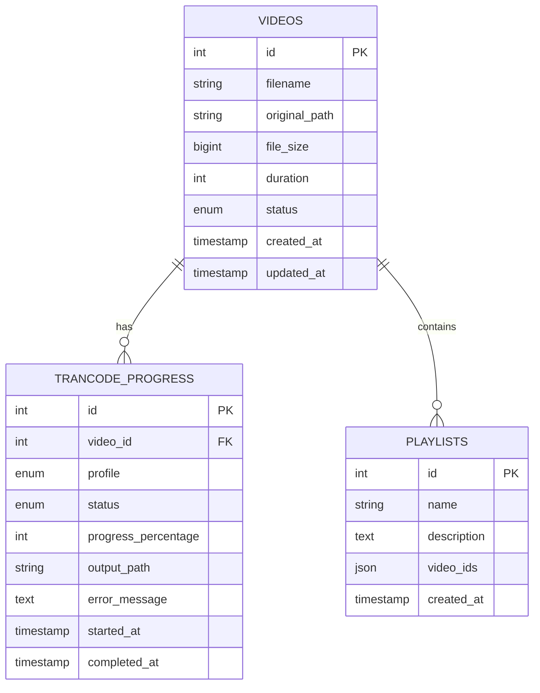
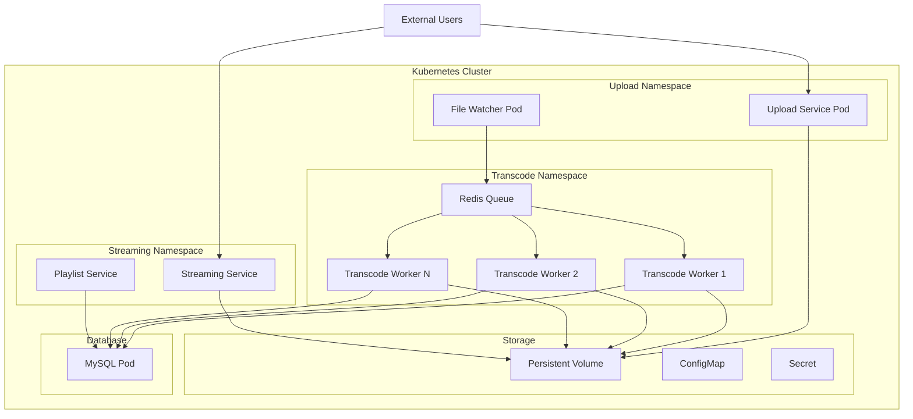

# Linier Channel - Video Transcoding Flow

## System Architecture Flow



## Detailed Transcoding Process



## Database Schema Relationship



## Kubernetes Deployment Architecture



## HLS Output Structure

```
/transcoded-videos/
├── video1/
│   ├── 720p/
│   │   ├── playlist.m3u8
│   │   ├── 00001.ts
│   │   ├── 00002.ts
│   │   └── ...
│   ├── 480p/
│   │   ├── playlist.m3u8
│   │   ├── 00001.ts
│   │   └── ...
│   └── 360p/
│       ├── playlist.m3u8
│       ├── 00001.ts
│       └── ...
└── master.m3u8
```

## URL Patterns

- Master Playlist: `{base_url}/videos/{video_id}/master.m3u8`
- Profile Playlist: `{base_url}/videos/{video_id}/{profile}/playlist.m3u8`
- Video Segments: `{base_url}/videos/{video_id}/{profile}/{segment}.ts`


